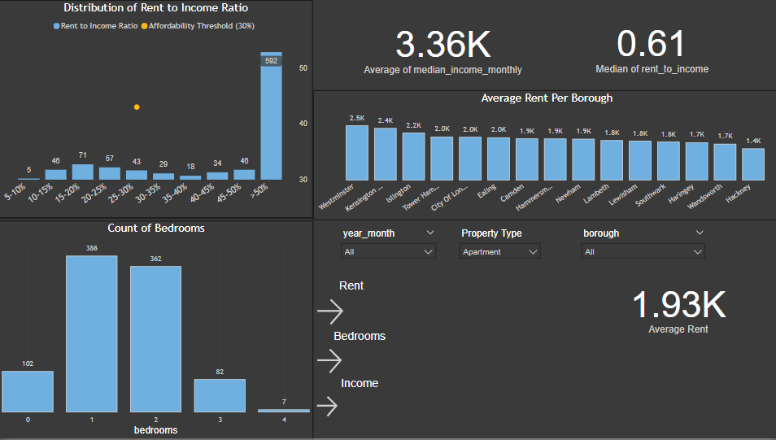
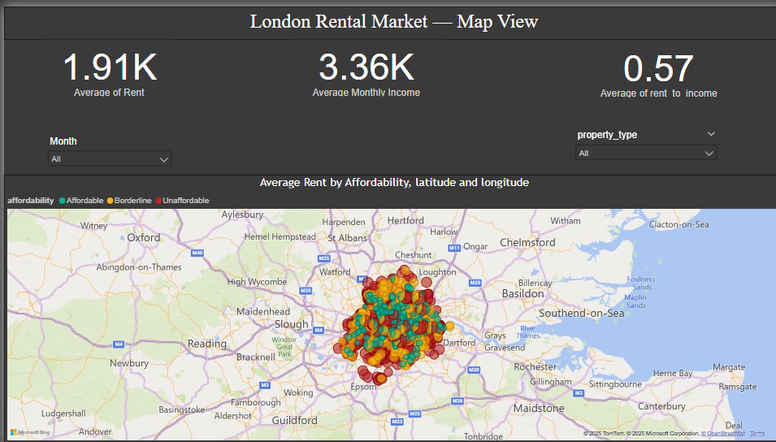
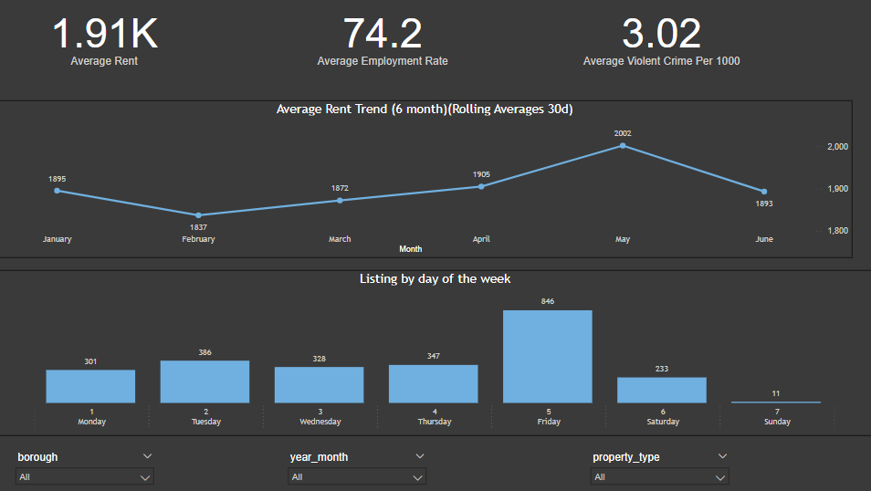
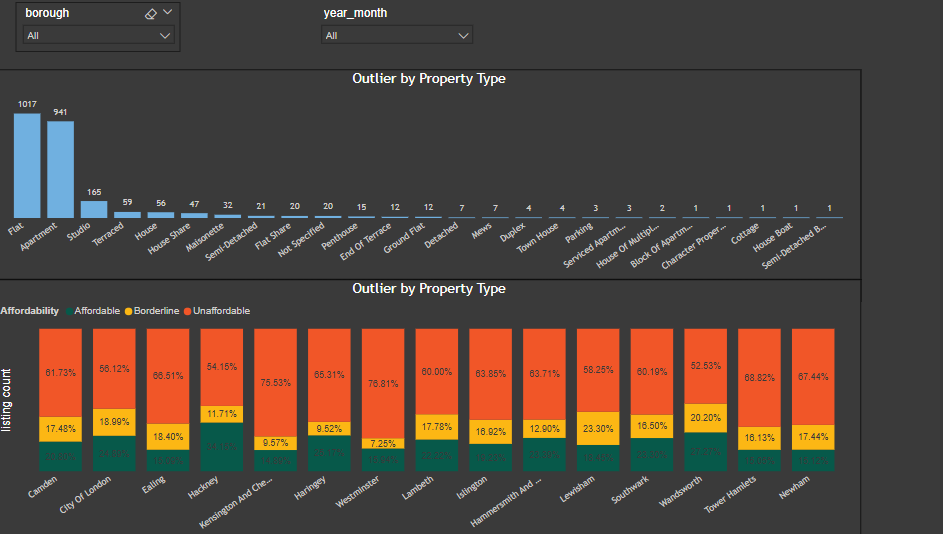

London Rental Market Analysis (Jan 2025 – Jun 2025)
Built a comprehensive analytics pipeline from web-scraping to interactive dashboards to uncover pricing dynamics and affordability challenges in Inner London’s private rental market.

## Project Overview
* Scope: Scraped and harmonized listing data from the UK’s top three rental platforms.
* Timeframe: January through June 2025 (6 months of listings).
* Geography: 12 Inner London boroughs.

## Key Objectives
1. Pricing Trends
• Visualize average rent trajectories with 7- and 30-day rolling windows.

1. Affordability Analysis
• Compute Rent-to-Income ratios: categorize boroughs into Affordable, Borderline, Unaffordable.
• Highlight the top 3 most unaffordable boroughs.

2. Market Dynamics
• Identify outlier listings (top 5% by price for 2–3 bed units).
• Examine weekday listing volumes to optimize posting strategies.

3. Advanced Explorations (Python)
• Correlation matrix and top-10 feature importance across price, income, crime, employment, and GCSE scores.
• Regression analyses: Rent vs. Income, Rent-to-Income vs. Crime exposure.

## Tech Stack
* Data Acquisition:	Python (requests, BeautifulSoup)
* Data Engineering:	Pandas, NumPy; SQL Server (T-SQL)
* Statistical EDA:	Seaborn, statsmodels, scikit-learn
* Visualization:	Power BI (DAX, custom visuals, bookmarks)
* Version Control:	Git & GitHub

## Key Takeways 
* Major Unaffordability: Over 62% of listings exceed the 30% rent‑to‑income threshold, peaking at 77% in Westminster & Kensington & Chelsea.

* Luxury Outliers: The top 5% priciest 2–3 bed listings (≥ £5 k pcm) concentrate in SW3, SW1, and W1 postcodes.

* Rent Pressure Point: Most rentals cluster at 50–60% of median income, well above common affordability guidelines.

* Optimal Listing Timing: New listings surge mid‑week (especially Wednesday), offering a strategic posting window.

## Dashboard Screenshots

  
*Overview with toggle controls*

  
*Affordability buckets by borough*

  
*30‑day rolling average rent*

  
*Top 5% outliers by property type*

